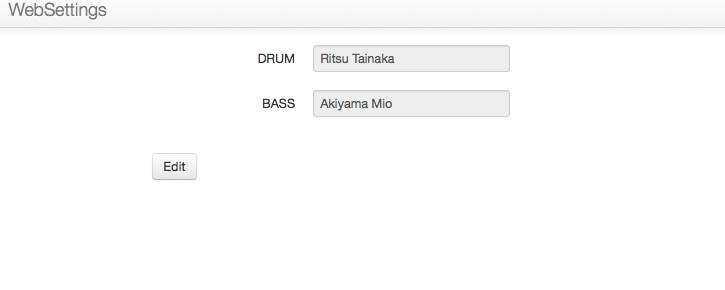
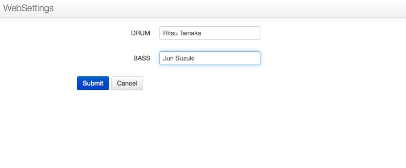

Introducing django-websettings
==============================

I released new package named `django-websettings`. This is django's
third party application to provide a web interface to set a yet another
django's settings.

If you are similar to read English, please read [the README of
django-websettings](https://pypi.python.org/pypi/django-websettings).

I write in Japanene from here.

django-websettingsの紹介
------------------------

私のpoorなGithub Englishが好きな人は今すぐREADMEから読んでください。

django-websettingsはDjangoのサードパーティアプリケーションで、
Webインタフェースから設定可能なsettings.pyのようなものを提供するものです。

ユーザーさんにちゃっちゃと手直しして欲しいような値を、Webインタフェースから
入力して貰えたらなと思って作った。インストール方法などもREADMEを見てほしい。

基本的には予め指定したwebsettings.pyというファイルに以下のように書く:

``` {.sourceCode .python}
# In websettings.py
DRUM = 'Ritsu Tainaka'
BASS = 'Mio Akiyama'
```

値は `websettings` から取れる。

``` {.sourceCode .python}
>>> from websettings import websettings
>>> websettings.BASS
'Mio Akiyama'
```

websettings.pyを書くと自動でWebインタフェースが作られて、これらの設定値を入力できる。



こんなかんじで書き換える(ベースを純ちゃんにした)



これでsubmitしてからもう一度シェルを叩くと、値が変わっている:

``` {.sourceCode .python}
>>> websettings.BASS
'Jun Suzuki'
```

というもの。 詳しくは [README
みてください](https://pypi.python.org/pypi/django-websettings) 。

