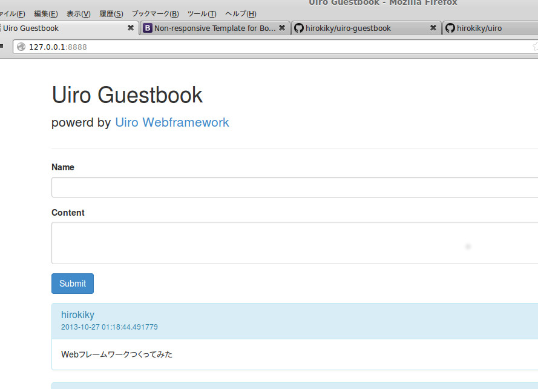

Uiro frameworkでguestbookアプリ作った
=====================================

ちょっとお遊びでゲストブックアプリケーションなど作りました｡

-   [Uiro Guestbook](https://github.com/hirokiky/uiro-guestbook)

[Uiro](https://github.com/hirokiky/uiro) という Web
フレームワークを作っている最中なのですが､まぁそのデモとしてです｡
この程度のアプリが作れる程には使えるようになっています｡

使ってるのは以下です:

-   WebFramework: [Uiro](https://github.com/hirokiky/uiro)
-   Form: [deform](https://pypi.python.org/pypi/deform)

あとTemplateやORMは [Uiro](https://github.com/hirokiky/uiro)
が依存しているものを使っています｡

-   Template: [mako](http://www.makotemplates.org/)
-   ORM: [SQLAlchemy](http://www.sqlalchemy.org/)

他にも [Uiro](https://github.com/hirokiky/uiro)
は色んなライブラリを使って積極的に依存しています｡
代わりにありきたりな記述を減らしたり､プラガブルかつバージョンの依存関係に
悩まされないアプリケーションの提供地盤であろうとしています｡

先日書いた
[PasteScript空騒ぎ](http://blog.hirokiky.org/2013/10/21/muchadoabout_pastescript.html)
にも登場した [gearbox](https://pypi.python.org/pypi/gearbox/0.0.2)
さんもそうですし､ [Uiro](https://github.com/hirokiky/uiro)
のために書いたと言ってもいい
[matcha](http://blog.hirokiky.org/2013/10/06/released_matcha.html)
なども使っています｡

[Uiro](https://github.com/hirokiky/uiro)
はあとREADMEと機能テストを整備して0.1リリース｡
そのあとは各アプリケーションでテストを書くためのユーティリティの提供や
ミドルウェアの記述点などなどです｡ はやく
[WeiWei](https://github.com/hirokiky/weiwei) を
[Uiro](https://github.com/hirokiky/uiro) ベースにしたいです｡

ちなみにゲストブックアプリを書いてみたのは､tokibitoさんがBottleとpeeweeで作ってて
面白そうだったからです｡

-   [Bottleとpeeweeを使ってゲストブックアプリケーションを作ってみた](http://d.hatena.ne.jp/nullpobug/20131026/1382728022)

