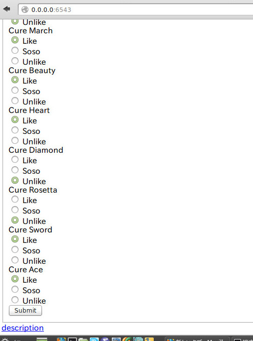
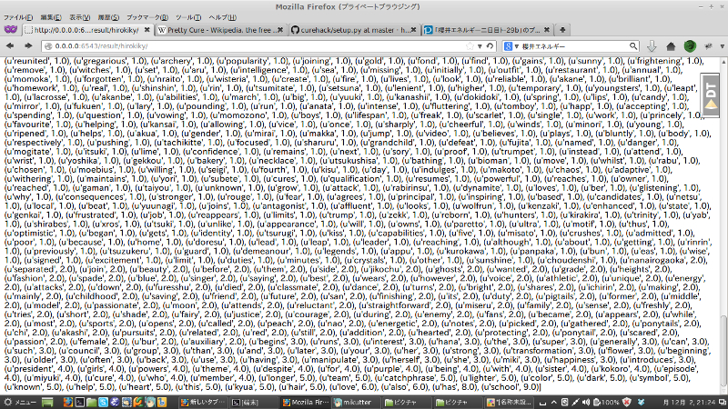
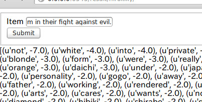
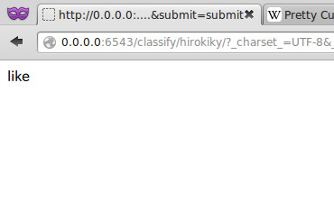
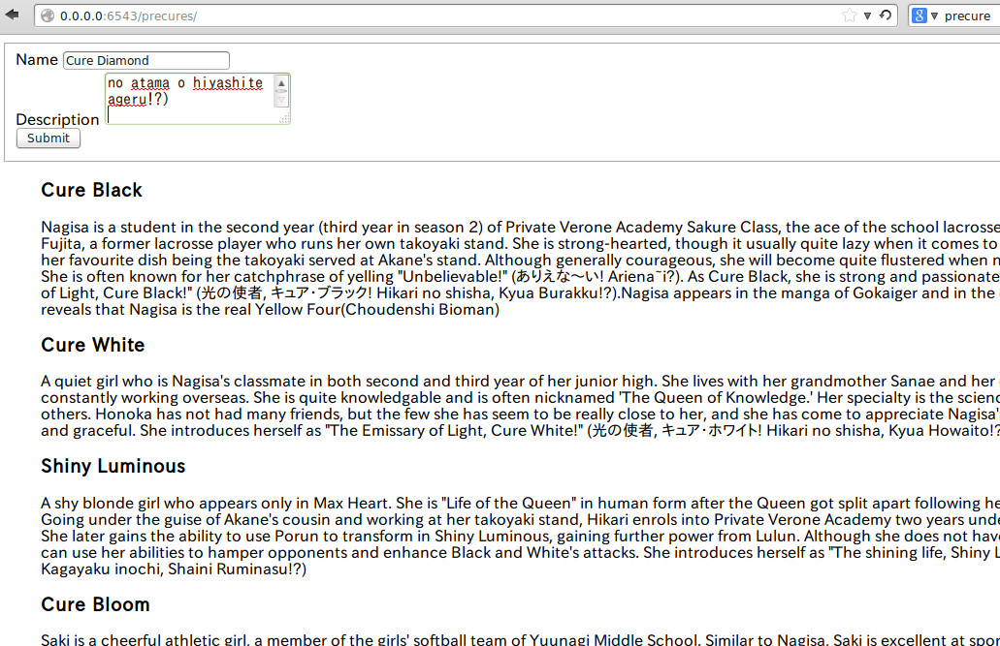

好きなプリキュアからアニメをオススメするWebアプリ作った プリキュア Advent Calendar 2013 (2日目)
===============================================================================================

[プリキュア Advent Calendar](http://www.adventar.org/calendars/147)
2日目担当の @hirokiky です｡

[1日目](http://drillbits.hatenablog.com/entry/cure_advent_2013_miraclelight)
に @drillbits
氏が面白いもの作ってて非常に悔しい思いをしています｡私もプリキュアにからめたネタでコードを書いたという話です｡

作ったもの
----------

作ったものは「自分の好きなプリキュアを選択していけばオススメのアニメが分かるWebアプリ」です｡

こんな人におすすめです｡

-   自分はたしかにプリキュアが好きだけど､他にどんな面白いアニメがあるだろう｡
-   新作のアニメはひと通り観ているが､面白いものを見つけるのにも時間を取られてしまう｡
-   プリキュア以外で自分の趣向を表現できない

**そういった疑問に答えるためのWebアプリケーションです｡**

今日から「今晩見るアニメ」に悩む必要はありません｡ただあなたは「好きなプリキュアのキャラを選択する」
だけでいいのです｡
そうすればこのWebアプリケーションが､即座にあなたの観るべきオススメのアニメを紹介してくれます｡

というのは煽りです
------------------

というのは煽りですが､それなりにはできました｡
デプロイもしてないのでスクリーンショットでもみていきましょう｡

好きなプリキュアを選ぶ画面です｡


ユーザー名を入力した後に､プリキュアの各キャラを「Like」「Soso」「Unlike」に設定していきます｡
ここでのポイントは **心を鬼にしてUnlikeをつけること**
です｡Likeばっかりつけてると後々いい結果がでません｡



入力できました｡
キュアダイアモンドとキュアロゼッタをUnlikeにしてますが気にしないでください｡

さてここでsubmitボタンを押すとすごい画面が表示されます｡



各プリキュアに関連する単語(詳細後述)とユーザーの入力を突き合わせた何かです｡
ここのページの上部にあるフォームに､アニメの紹介文(英語)を入れます｡



そしてsubmitすると､そのアニメ(紹介文)がユーザーにとって好まれるものか､そうでないかを返します｡
とりあえず今回は
[プリキュアの紹介文](http://en.wikipedia.org/wiki/Pretty_Cure#Overview)
を入れてみました｡

結果



Likeと表示されました｡ 私はプリキュアが好きなようです｡

さて､さきほどいった「プリキュアに関連する単語」とは何だったのでしょうか｡
これは各プリキュアの紹介文から抽出した､そのキャラたる単語(特徴語)です｡

各プリキュアのデータも参照できます｡



各プリキュアの名前: プリキュアの紹介文(英文)が見えると思います｡
ここに入力された「名前」「紹介文」から先ほどの入力フォームや､特徴語を作っています｡

なので正直にいうと､選択肢として用意するのはプリキュアじゃなくてもできます｡

実装:PythonとMongoDB
--------------------

開発には Python を使っています:

-   言語: Python2.7
-   フレームワーク: Pyramid 1.5
-   永続化: MongoDB 2.2.4

コードみてください

<https://github.com/hirokiky/curehack>

動かしてみる
------------

おそらくこんなかんじで動きます:

``` {.sourceCode .sh}
git clone https://github.com/hirokiky/curehack
sudo apt-get install mongodb
cd curehack
python setup.py develop
pserve development.ini
```

フィルタリングはスパムフィルターで行った
----------------------------------------

アニメの推奨にはスパムフィルターを使っています｡

各プリキュアに対する[好き|嫌い]が､メールでいうところの[スパム|スパムじゃない]と同じと考えると分かりやすいです｡
あるプリキュアを「好き」とすれば､そのプリキュアに対する説明文から特徴語を抽出して学習させます｡
そのユーザー入力を通して得た好き嫌いのデータを元に､対象になるアニメの説明文をフィルタリングします｡

さっきのごちゃっとしたのがそれです｡

あとは単純ベイズフィルタとかいう魔法にかければうまくいきます｡
実はこれは「集合知プログラミング」という本のサンプルコードを参考に使っています｡
今回はそのバックエンドをMongoDBに対応させる処理を書いています｡

まとめ
------

-   好きなプリキュアを選ぶとオススメのアニメを紹介するWebアプリを作った

これから開発を続けて､お遊びサービスとして公開するのも良いかと思いますが､
私が壊滅的に飽き性なのでそれはないと思います｡

ちなみにこのコードは以前の
[プリキュアハッカソン](http://connpass.com/event/2772/)
で書いたものです｡
頑張った割に紹介とかしてなかったのでこの期に書いて見ました｡

以上です｡

