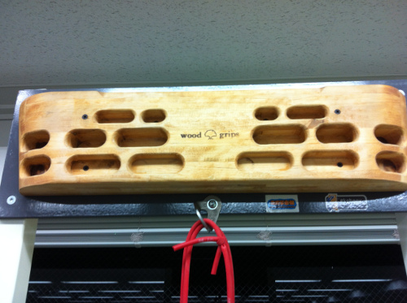
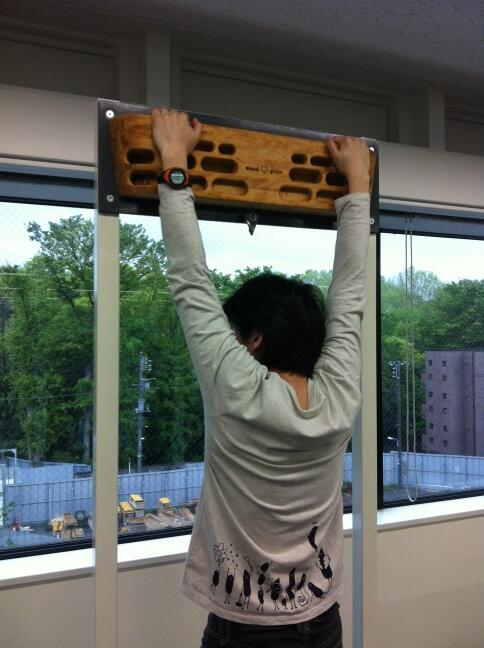
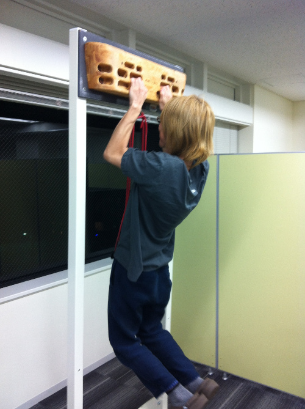
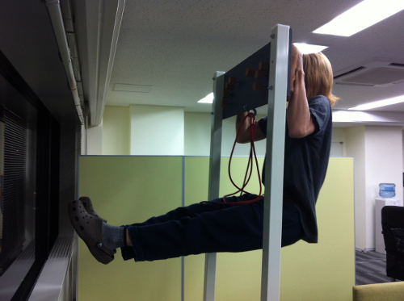
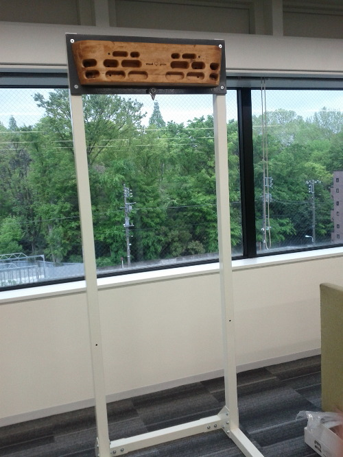
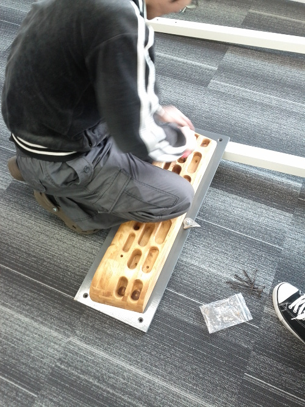

グリップボードで鍛える #kabepy advent calendar 2013
=========================================================
`#kabepy アドベントカレンダー2013 <http://connpass.com/event/4313/>`_
7日目を担当します :tw:`@hirokiky` です｡
今回はボルダリングそのものでなく､グリップボードの紹介をします｡

グリップボードって?
-------------------------------

懸垂したりぶら下がったりして指や腕を鍛えるための板です｡
ものによってはシミュレーターやフィンガーボードやグリップボードと呼ばれたりもしていて､製品によって形にも違いがあります｡
共通して普通の懸垂器と違う点は､より指などを鍛えるために色んな種類の穴が開いているとこです｡

こんなかんじです:

横に3行､縦には6個ほど穴が開いているので､そこに指を入れて懸垂などをします｡
あとは右上と左上に開いている大きな穴を使ったり､ボード上部のなめらかな傾斜をつかってトレーニングします｡

見ればなんとなく分かるかもしれませんが､下にある穴ほど浅くできています｡
一番下の真ん中2つの場合､第二関節に届くか届かないかくらいの浅ささで､
ぶら下がるだけでも難しいです｡

トレーニング方法
-----------------------
基本的には `取り扱い説明書的なもの(PDF) <http://www.lostarrow.co.jp/support/pdf/clim_0507_01.pdf>`_  を読んでやっています｡

ここでは細かい説明はしないので､雰囲気だけ伝わればいいかなと思います｡

:tw:`@takanory` さんがぶら下がっているようすです｡
このまま数十秒耐え忍んでもいいですし､懸垂してもいいです｡

ぶら下がるにも色々あって､腕をL字にしたままにしたりもします｡
このまな10､20数秒保持して､腕を鍛えます｡

さらに足をあげて､腹筋や背筋も鍛えます｡
これをやって嬉しいのは､壁を登る際に体を壁に引き連れる力がつく点です｡
この体制のまま体を保持したり､足を少し上下させてさらに腹筋などを鍛えたりします｡

こういったトレーニングを組み合わせて､1回10分ほどのセットにしています｡
1分区切りで､その1分ごとに「腕をL字で15秒保持｡指3本で懸垂3回」のように決めたことをこなしていきます｡

最近はとくに指を鍛えたいなと思っているので､一番浅い穴でぶら下がったり2本指でぶら下がったりしています｡

どこに設置するか
-----------------------
さて､いざやってみるかとなっても設置に悩みます｡
概ねこういったトレーニングボードは壁にうちつけて使うようになっていますが､
マンションや自宅でもなかなか壁に穴を開けるのは気軽ではないです｡

そこでオススメしたいのが､取り付ける様の「懸垂器」的なのを用意することです｡

これがあれば壁に穴を開ける必要もないですし､移動したくなってもすぐにできます｡
さらにありがたいことにフックがついているので､ここからゴムをぶら下げて補助としても使えます｡

:tw:`@takanory` さんがこの懸垂ラックを､私がフィンガーボードをもってきてフュージョンしました｡

ちなみにこの懸垂ラック､BePROUDのオフィスに置かせてもらってます｡
もし気が向いたら懸垂しにきてください｡

.. author:: default
.. categories:: none
.. tags:: kabepy,bouldering
.. comments::
