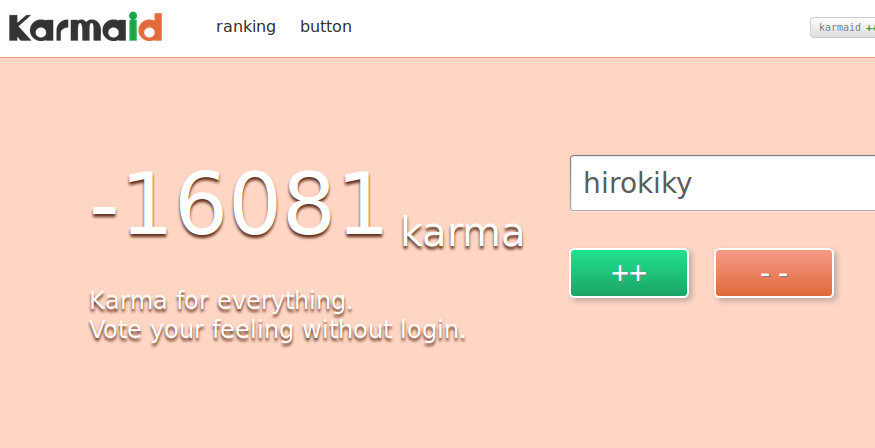

新サービスKarmaidをリリースしました
==========================================================

.. image:: https://raw.githubusercontent.com/hirokiky/karmaid/master/karmaid/static/images/karmaid.png
    :target: http://karmaid.org/

新規にWebサービス Karmaid_ をリリースしました。世界中すべてのものに未ログインで評価できるサービスです。
ここでは Karmaid_ というサービスについてと、リリース後にあった秒間200リクエストの話をします。

Karmaid とは
----------------------

好きな文字列にインクリメント/デクリメントができるサービスです。
サイドバーの私のアイコンの下にあるのがそれです。

Karmaid の目的
--------------------

Karmaid_ の目的は「気軽に何でも評価する」です。
特徴として以下の3点があります

* プラス評価とマイナス評価の両方が提供されている
* ログインが不要
* 何にでも評価ができる

++と--の両方を提供
+++++++++++++++++++++++++++++

Karmaid_ ではプラス評価とマイナス評価を提供しています。
いいな、と思うときはインクリメント(++)を、そうでもないなと思うときはデクリメント(--)をします。

これで **ただ単に拡散されているだけの情報を排除** できます。

ちなみに現時点での私のカルマは -16081 です。なるべく相手にしないほうがいいですね。

ログインが不要
++++++++++++++++++++++

これも Karmaid_ の大きな特徴です。
すべてのユーザーは制限された回数内で好きにインクリ、デクリができます。
ログインも不要なので、 Karmaid_ のボタンを設置しておけば誰でも気軽に評価することができます。

ログインが不要な場合、カルマの信頼性が下がりますが、ユーザーが十分いれば信頼できる値になるだろうと考えています。
不当な評価になりにくいよう作っていきます。

何にでも評価ができる
+++++++++++++++++++++++++++++

多くのWebサービスではURLを対象に人の評価を行う場合が多いです。ですが Karmaid_ にはその制限がありません。
人、もの、フレーズ、もちろんURLも含めてすべてにカルマが付けれます。

今後としては Non-ASCII のサポートや、URLに特化したKarmaidボタンを作って、より幅広く扱いやすくしていきたいです。

リリース後の反応
---------------------------

最大で222リクエスト/秒いきました。
8時20分くらいにリリースのアナウンスをしてから30分後くらいのことです::

  08:52:50    222
  08:52:55    217
  08:52:46    216

分速では4000くらいでした::

  08:52    4146
  10:26    3893
  09:55    2447

でもアプリは意外とピンピンしてました。アプリ以外のところがネックになったようです。
大量にデクリメントしてくれた方 (:tw:`@kiris` さん :tw:`@ishikawa84g` さん)、ありがとうございます。
よほどクリックがお得意なようです。

リリースアナウンスから今まで平均すれば、画面からポーリングしてる分含めて秒間1リクエストくらいですね。まぁそんなものかなと。

もちろん問題発見に一役買ってくれたり要望を投げてくれた :tw:`@shomah4a` さん :tw:`kazyk` さん :tw:`inoshiro` さん、ありがとうございます。
とりあえずalert文を入れてくれた方もありがとうございます。俺もよくやります。

おわりに
-----------------

気に入ったら `インクリしてください <http://karmaid.org/>`_ 。
あと `Githubのリポジトリ <https://github.com/hirokiky/karmaid>`_ でスターしてくれても元気がでます。

Karmaid_ をよろしくお願いします。

.. _Karmaid: http://karmaid.org/

.. author:: default
.. categories:: none
.. tags:: release,karmaid
.. comments::
